# Instagram desktop app

  

## Developers

**Update Galaxy team:**
- [**Muhammad Karbalaee Shabani**](https://gitlab.com/muhammadksht)
- [**Reyhaneh Saffar**](https://gitlab.com/rsf122456)
- [**Hasan Roknabady**](https://gitlab.com/HasanRoknabady)
\
  \
  _Computer Science students at Shahid Beheshti University_
  \
  Mathematical sciences' faculty
### Summary
This project is developed as the final project for our advanced Java programming course at SBU.
\
Our application is meant to be a template of Instagram desktop application.
### Features
  
- __**Graphical User Interface**__
  \
  \
  contains an impressive GUI, designed and implemented by JavaFX technology

  -  _login and sign up_
  
    

      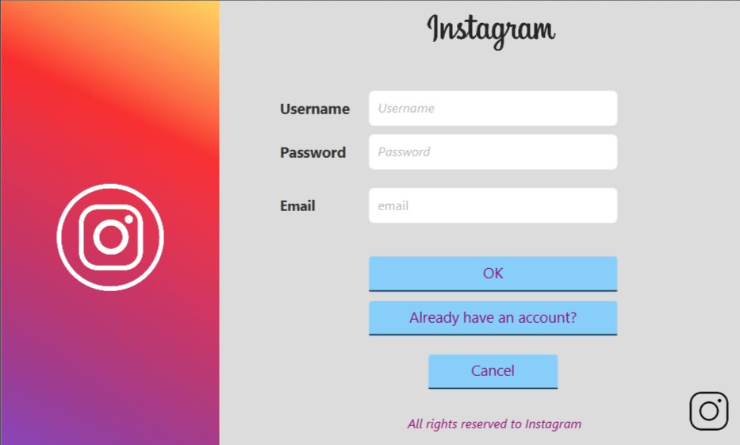
    

  -  _main feed_
    

      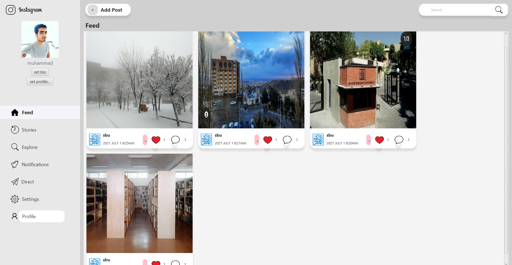
    

  -  _add post_
    

      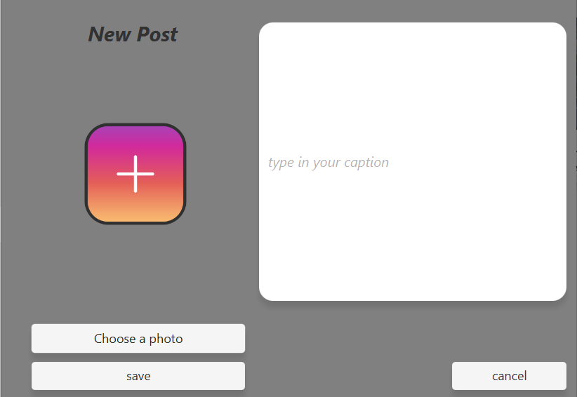
    

  - _user search_
    

      
    

  
  - _profile_
    

      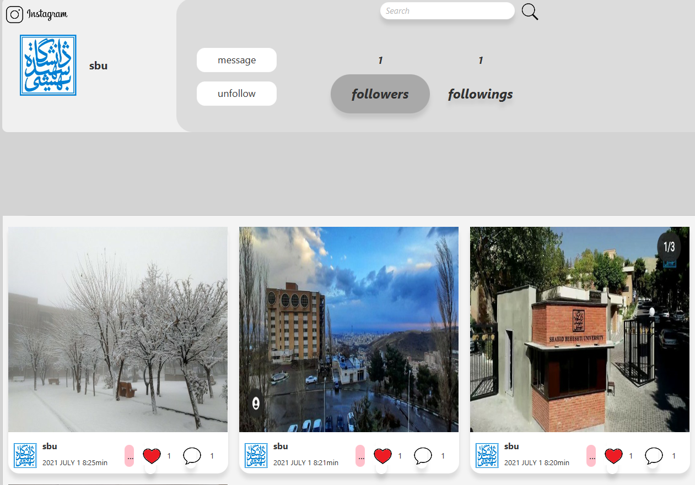
    

  - _followers and followings list_
    

      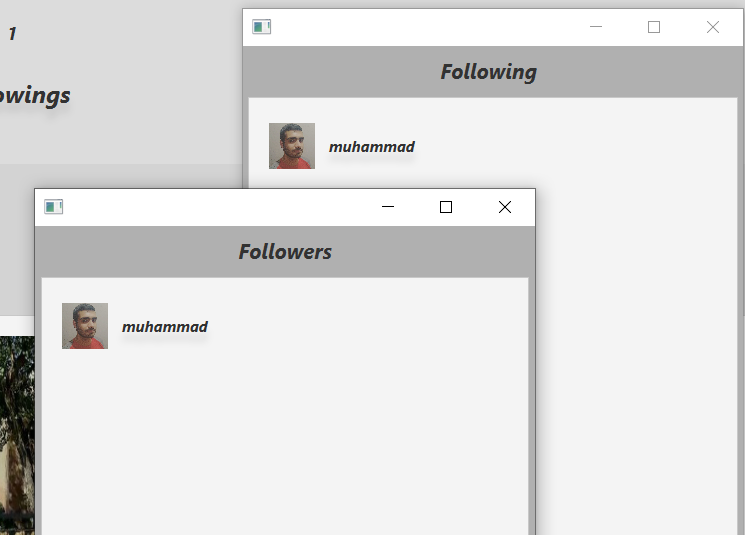
    

  - _direct messaging_
    

      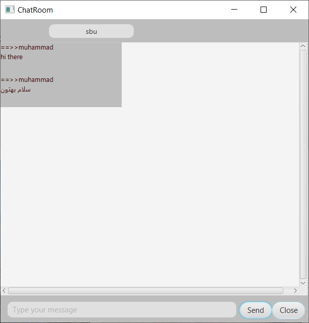
    

  - _post_
    

      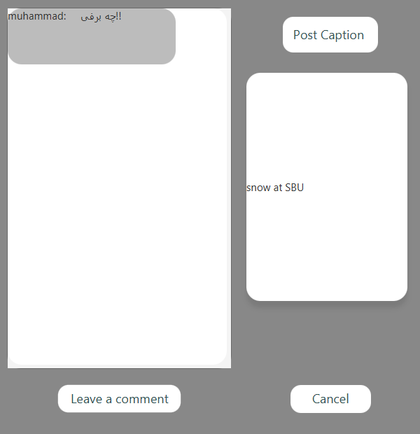
    

    

      
    

    

      
    

    

      
    

  - _likes list_
    

      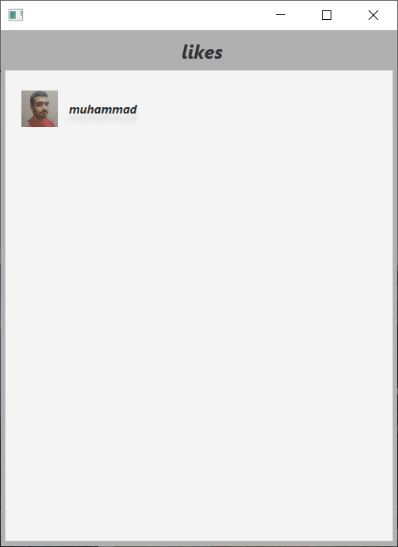
    

  - _setting profile picture_
    

      
    

  - _setting bio_
    

      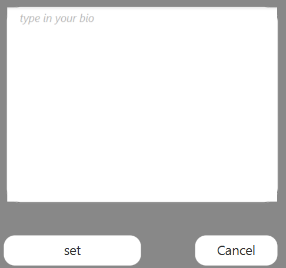
    

- __**Object-orientation**__

this project is implemented in an absolutely object-oriented approach. since we used Java for this project,
we tried to use the full power of Java in terms of object orientation. the project is very well organized and maintainable
because every part of the program is developed within a separate package obviously-named. Each package consists of 
classes and fxml files of its own. we tried to obey the SOLID rules as much as we could in this project.

  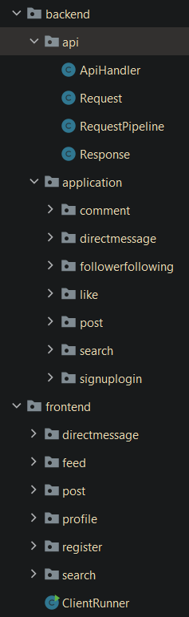

- __**Version Control tools**__

Our team work was organized and merged and developed upon Git and we made separate branches for different kind of tasks
and after implementing an specific part of the project the team members would push the changes and notifying the
maintainer of the project to merge their changes after checking their provided code.

- __**Team work**__

The entire project was developed under four main phases
- 1st phase: designing and building an API
- 2nd phase: implementing follow,profile,login,sign up features
- 3rd phase: implementing direct,post,comment,like features
- 4th phase: adding additional features and testing and debugging the whole project

Each phase very well organized and divided into separate tasks assigned to a developer and having a due date
\
[Task Boards](https://gitlab.com/update-galaxy-group/instagram-app/-/boards/2842705)
\
[Git graph](https://gitlab.com/update-galaxy-group/instagram-app/-/network/master)
\
[Contributions](https://gitlab.com/update-galaxy-group/instagram-app/-/graphs/master)

- __**Database**__

For this project Mysql database is used for storing data on server.
\
Here is the schema:

  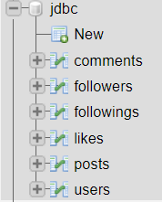

- __**Socket Programming**__

This project consists of two different applications, a client app and a server app developed by the socket programming tools and 
concpets in Java

- __**Multi-threading**__

To handle numerous clients simultaneously on server-side multi-threading concepts are used. clients are 
handled by being passed to a threadpool and shared methods between multiple threads are synchronized to avoid 
the race condition and data loss

- __**Documentation**__

All classes and methods and packages are documented using Javadoc and used by team members during the development process
\
[Link to documentations](http://janax-artwork.ir/)

### Acknowledgements

I myself thank my teammates,[Reyhaneh Saffar](https://gitlab.com/rsf122456) and [Hasan Roknabady](https://gitlab.com/HasanRoknabady) ,for this great cooperation and their contributions, also the high-quality codes
that they provided and further developed the project.
\
I also should thank my mentors, [Ali Aliabadi](https://gitlab.com/ali-aliabadi) 
and [Saeid Cheshmi](https://gitlab.com/s.ch), for helping me during the Advanced Programming course at SBU.
\
Finally I thank Prof. Kheradpisheh, the master of this course, for the great and high-quality course that they provided us with.